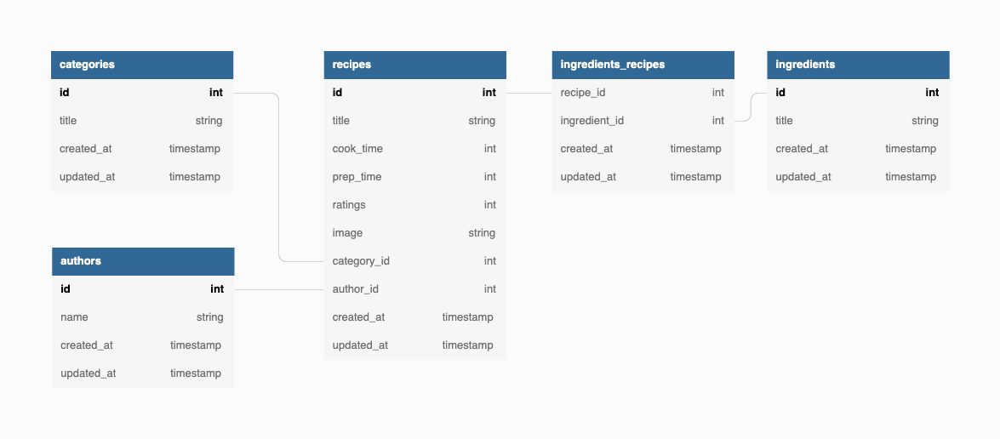

# Cookmeister

Cookmeister is a prototype implementations of an application that allows a user to find recipes based on the ingredients of their choice. 

This repository includes the backend part of the application built in Ruby on Rails as well as the frontend built in ReactJS.

The Database is built using PostgreSQL.

The search functionality is implemented using ElasticSearch. 

# Table of Contents
1. [Prerequisites](#prerequisites)
2. [Installation](#installation)
   1. [Elasticsearch](#elasticsearch)
   2. [Backend configuration](#backend-configuration)
   3. [Frontend configuration](#frontend-configuration)
3. [Demo](#demo)
4. [License](#license)

## Prerequisites
- Ruby 3.0.0
- Rails 7.0.0
- PostgreSQL 11+
- Node 14+
- npm 6+
- React 18+
- Git

## Installation
### Elasticsearch
You can either start a local instance of Elasticsearch following the official [documentation](https://www.elastic.co/guide/en/elasticsearch/reference/current/install-elasticsearch.html)
or by creating a free account in the cloud solution that elasticsearch provides [here](https://www.elastic.co/cloud/).

In either case, **keep the credentials** for the connection to the backend. You will need them soon.

### Backend configuration <a name="Backend"></a>
Clone the repo.

Enter the cloned directory.

```
cd /path/to/cookmeister/directory
```

Run the rails bundler

```ruby
bundle install
```

Install Postgres following the official [documentation](https://www.postgresql.org/docs/11/tutorial-install.html).

Set up the databse for the application and seed it with the [provided dataset](db/recipes-en.json)
```ruby
rails db:create db:migrate db:seed
```


Open `config/database.yml` in an editor and replace the Elasticsearch credentials with the ones that Elasticsearch provided during its setup.  

Now you can start the backend at http://localhost:3000 by running
```ruby
rails s
```

### Frontend configuration
Navigate to the frontend directory
```ruby
cd cooking_partner 
```

Run 
```
npm install
```
and then
```
npm run start
```
When webpack asks to run in a different port than 3000 (since it is taken by Rails) type `yes` and let it start on port 3001.

And you are ready to go!!
Enter the browser of your choice and type `http://localhost:3001`

## Demo
You can try to find a recipe using the ingredients you have at home by visiting the live demo [here](https://cooking-partner.herokuapp.com/)
### Preview


## License
[MIT](https://choosealicense.com/licenses/mit/)
